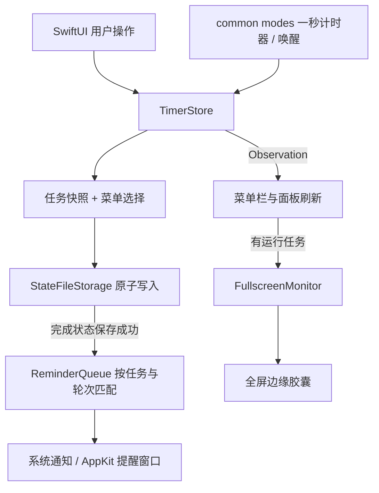

# 原生架构

Still 是本地 macOS 菜单栏倒计时应用，无账号、服务端或第三方依赖。Swift Package 最低部署目标为 macOS 14。

## 模块职责

- `Sources/Still/TimerState.swift`：Countdown、SavedState、提醒等级、配色与外观偏好、胶囊位置和安全时间格式化；校验存档版本、任务唯一性与数值范围。
- `Model.swift`：主线程可观察的 TimerStore，管理任务状态转换、菜单选择、偏好和完成提交。任务与菜单选择对外只读，通过动作方法修改。
- `StateFileStorage.swift`：JSON 解码、校验、旧版备份和原子写入。时钟、存储路径、写入器可注入测试。
- `Appearance.swift`：SwiftUI 颜色映射与 AppKit 外观适配。
- `StillApp.swift`：应用生命周期、菜单栏和面板协调、系统唤醒连接。
- `Views.swift`、`InlineCreateView.swift`、`SettingsView.swift`：任务列表、原位创建与设置；通过 Store 修改状态。
- `TaskSorting.swift`、`TaskScrollView.swift`：排序与滚动支持。
- `ReminderQueue.swift`：按运行轮次过滤事件、管理活动提醒身份和顺序，不依赖系统窗口。
- `Reminders.swift`：通知授权、系统通知、中央和多屏提醒窗口；窗口回调必须属于当前活动事件。
- `LoginItemController.swift`：以 SMAppService 状态管理登录自启，服务操作可注入测试。
- `FullscreenMonitor.swift`、`EdgeCapsule.swift`：通过辅助功能读取前台窗口全屏状态，协调单个边缘胶囊。
- `GlassSurface.swift`、`ButtonFeedback.swift`：原生材质与控件反馈。

## 数据与交互约束

数据存于 `~/Library/Application Support/Still/state.json`，原子写入。当前格式版本为 2；迁移版本 1 前保留备份，损坏或未知版本数据禁止覆盖。

运行任务以绝对截止时间校准，暂停保存剩余时间；关闭面板不暂停。退出或休眠期间到时，恢复后合并轻提醒。完成状态先保存，再发布状态并发送提醒；写入失败保留截止时间供后续重试。用户调整系统时间按真实墙钟解释。

一次任务操作同时计算任务快照与菜单选择，再写入一次；重复偏好赋值不触发保存。每次开始、继续、重试或加时分配新的运行序号，旧提醒不能作用于后续轮次。加时阶段保存 `originalDuration`，重置或“再来”恢复原定时长。

新建任务等待主动开始，名称最多 40 字符，空名称使用默认名称，时长上限 1440 分钟。每任务独立提醒等级；设置页等级只用于预览。菜单栏当前任务与列表顺序独立。

macOS 26+ 使用原生液玻，旧系统有材质回退。辅助功能未授权时保留菜单栏计时功能。HTML 只作设计依据，不是应用运行容器。

## 状态与系统事件流

只有完成转换以落盘成功为发布门槛；普通编辑即时反映到界面，保存失败会显示错误。进程可能在写入成功、通知送出前退出，这个崩溃窗口尚不具备事务性通知投递保证。

一秒计时器校准完成状态并刷新运行任务；用户操作通过 Observation 及时更新展示，不必等待下一秒。暂停/完成卡片停用周期刷新；空闲时跳过全屏窗口查询，授权状态在设置出现和应用激活时更新。

## 开发与验收入口

运行方式见 [README](../README.md)。设计基准见 [原型索引](../prototype/README.md)，当前实现与待验收项见 [v1.8 验收记录](验收记录-V1.8.md) 与 [架构审查与优化记录](架构审查与优化-2026-10-05.md)。这里仅维护模块职责和共用约束，不重复维护逐版进度。
